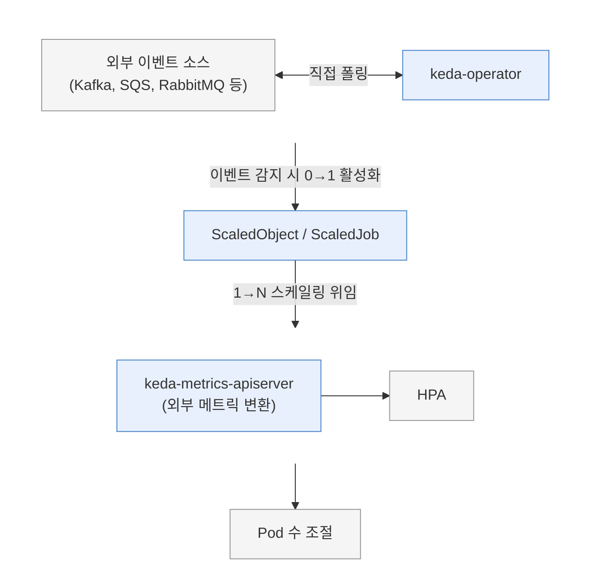

# KEDA (Kubernetes Event-Driven Autoscaling) 발표 자료 정리

> 출처: [NotebookLM - KEDA Research](https://notebooklm.google.com/notebook/70fc7310-02e6-422d-9cea-cc8afbc2bdcb)
> 정리일: 2026-03-06

---

## 1. KEDA 개요

KEDA(Kubernetes Event-Driven Autoscaling)는 Kubernetes 환경에서 **외부 이벤트 소스를 기반으로 워크로드를 자동 스케일링**하는 오픈소스 프로젝트입니다. 기존 HPA(Horizontal Pod Autoscaler)의 구조적 한계를 보완하여, CPU/메모리 같은 내부 리소스 지표뿐만 아니라 메시지 큐, 데이터베이스, 클라우드 서비스 등 **70개 이상의 외부 이벤트 소스**를 기반으로 스케일링을 수행합니다.

- **공식 사이트**: https://keda.sh/
- **CNCF 프로젝트 페이지**: https://www.cncf.io/projects/keda/
- **GitHub**: https://github.com/kedacore/keda

---

## 2. KEDA의 역사와 CNCF 여정

| 시점 | 마일스톤 | 상세 |
|------|----------|------|
| **2019년 5월** | 프로젝트 발표 | Microsoft Build에서 **Microsoft와 Red Hat의 전략적 파트너십**으로 오픈소스 프로젝트로 시작. Azure Functions의 이벤트 기반 스케일링 모델을 Kubernetes에 도입하기 위한 목적 |
| **2019년 11월** | KEDA 1.0 릴리스 | 프로덕션 준비 완료. Kafka, RabbitMQ, AWS SQS, Azure Queues 등 **13개 이벤트 소스** 지원 |
| **2020년 3월 12일** | CNCF Sandbox 편입 | 벤더 중립적 프로젝트로 발전하기 위해 CNCF에 기증 |
| **2021년 8월 18일** | CNCF Incubating 승급 | 스케일러 12개→37개로 증가, TriggerAuthentication 등 프로덕션 기능 추가. Alibaba, CAST AI, Microsoft 등 다수 기업 도입 |
| **2023년 8월 22일** | **CNCF Graduated 졸업** | Kubernetes, Prometheus, Istio와 같은 등급. 수천 개의 ScaledObject 대규모 처리 가능. **45개 이상 공식 기업 사용자** 확보 |

### 참고 링크
- [Announcing KEDA (Microsoft, 2019)](https://opensource.microsoft.com/blog/2019/05/06/announcing-keda-kubernetes-event-driven-autoscaling-containers)
- [KEDA 1.0 Release (Microsoft, 2019)](https://opensource.microsoft.com/blog/2019/11/19/keda-1-0-release-kubernetes-based-event-driven-autoscaling?ref=blog.tomkerkhove.be)
- [CNCF Incubating 승급 (2021)](https://www.cncf.io/blog/2021/08/18/keda-moves-from-the-cncf-sandbox-to-become-an-incubating-project/)
- [CNCF Graduated 졸업 (2023)](https://keda.sh/blog/2023-08-22-keda-cncf-graduation/)
- [Red Hat + Microsoft 협업](https://www.redhat.com/en/blog/red-hat-collaborates-microsoft-keda-enable-azure-functions-openshift)
- [Microsoft Azure - Kubernetes 파트너십](https://azure.microsoft.com/en-us/blog/partnering-with-the-community-to-make-kubernetes-easier/)

---

## 3. 핵심 아키텍처

### 3.1 세 가지 핵심 컴포넌트

KEDA를 설치하면 Kubernetes 클러스터에 다음 3가지 컴포넌트가 배포됩니다:

#### 1) `keda-operator` (Agent / Controller)
- ScaledObject 및 ScaledJob CRD의 **수명 주기를 관리**하는 메인 컨트롤러
- 외부 이벤트 소스를 **지속적으로 모니터링** (pollingInterval마다 직접 폴링)
- **0 ↔ 1 스케일링 전담**: 이벤트가 없으면 파드를 0으로 축소, 이벤트 발생 시 즉각 1개로 활성화
- 1→N 스케일링은 내부적으로 생성한 HPA에 위임

#### 2) `keda-operator-metrics-apiserver` (Metrics Server)
- 외부 이벤트 시스템에서 획득한 데이터를 **Kubernetes HPA가 이해할 수 있는 External Metrics 형태로 변환**하는 어댑터
- HPA는 이 서버를 통해 메트릭을 전달받아 **1→N 파드 확장**을 결정

#### 3) `keda-admission-webhooks`
- 사용자가 ScaledObject/ScaledJob을 생성·변경할 때 **구성을 자동 검증**하여 오설정 방지
- 예: 여러 ScaledObject가 동일 Deployment를 타겟팅하는 충돌 차단

### 3.2 스케일링 동작 흐름



### 참고 링크
- [KEDA Concepts (공식)](https://keda.sh/docs/2.19/concepts/)
- [KEDA Cluster 운영 가이드](https://keda.sh/docs/2.19/operate/cluster/)
- [KEDA Deep Technical Architecture (ASleekGeek)](https://asleekgeek.com/articles/keda-autoscaling)
- [KEDA 아키텍처 분석 논문](https://notebooklm.google.com/notebook/70fc7310-02e6-422d-9cea-cc8afbc2bdcb) (소스: "Architectural Resilience and Event-Driven Elasticity")

---

## 4. KEDA vs HPA 핵심 비교

> 📝 노트북 노트: "KEDA와 기존 HPA의 핵심 차이점 및 워크로드 비교"

| 비교 항목 | HPA | KEDA |
|-----------|-----|------|
| **스케일링 기준** | CPU/메모리 등 내부 리소스 지표 | 70개+ 외부 이벤트 소스 (메시지 큐, DB, 클라우드 등) |
| **Scale-to-Zero** | 불가능 (최소 1개 파드 필수) | **지원** — 이벤트 없으면 0개로 축소, 비용 극적 절감 |
| **대응 방식** | **사후 반응형 (Reactive)** — 리소스 초과 후 대응, 지연 발생 | **선제적 (Proactive)** — 부하 원인(큐 길이 등)을 직접 감시, 즉시 확장 |
| **적합한 워크로드** | 동기식 웹 서버, REST API | 비동기 이벤트 기반, 메시지 큐 소비자, 배치 작업, Bursty 트래픽 |
| **커스텀 메트릭** | 번거로운 어댑터 설정 필요 | 스케일러 플러그인으로 즉시 사용 가능 |
| **고급 기능** | 단순 스케일링 룰 | Scaling Modifiers, Fallback, ScaledJob, 복합 트리거 수식 |
| **관계** | Kubernetes 내장 | HPA를 내부적으로 활용하되 기능을 확장 (대체가 아닌 보완) |

### 핵심 포인트: KEDA는 HPA를 대체하지 않는다
- 1→N 스케일링은 KEDA가 내부적으로 **HPA를 생성하여 Kubernetes의 안정적인 로직을 위임**
- KEDA는 중간에서 **외부 이벤트 지표를 HPA가 이해할 수 있는 지표로 변환**해주는 다리(Bridge) 역할
- **0↔1 상태 전환(Scale-to-Zero/Activation)**만 KEDA가 직접 책임

### 참고 링크
- [KEDA vs HPA (Kedify)](https://kedify.io/resources/blog/keda-vs-hpa/)
- [KEDA vs HPA (Talent500)](https://talent500.com/blog/keda-vs-hpa-kubernetes-autoscaling-comparison/)
- [KEDA vs HPA Guide (Plural)](https://www.plural.sh/blog/keda-vs-hpa-guide/)
- [Kubernetes HPA 한계와 Best Practices (ScaleOps)](https://scaleops.com/blog/kubernetes-hpa/)
- [Kubernetes Autoscaling Best Practices (StormForge)](https://stormforge.io/kubernetes-autoscaling/)

---

## 5. 스케일러(Scaler) 직접 통신 원리

> 📝 노트북 노트: "KEDA 스케일러의 직접 통신 및 지표 수집 원리"

KEDA의 핵심 설계 원칙은 **중간 매개체 없이 대상 시스템과 직접 통신하여 지표를 수집**하는 것입니다. 각 스케일러는 자신이 담당하는 시스템에 인증하고 상태(메트릭)를 직접 쿼리하는 로직을 내장합니다.

### 스케일러별 직접 통신 예시

| 스케일러 | 통신 방식 | 수집 지표 |
|----------|-----------|-----------|
| **Kafka** | Kafka 브로커에 직접 연결 (bootstrapServers) | 컨슈머 랙(Consumer Lag) = 최신 오프셋 - 커밋된 오프셋 |
| **RabbitMQ** | AMQP/HTTP로 브로커 엔드포인트 직접 연결 | QueueLength, MessageRate |
| **AWS SQS** | AWS API 직접 호출 | ApproximateNumberOfMessages, In-flight 메시지 수 |
| **데이터베이스** (PostgreSQL, MySQL 등) | DB에 직접 커넥션 → SQL 쿼리 실행 | 사용자 지정 쿼리 결과값 |
| **Prometheus** | 프로메테우스 서버 API에 PromQL 쿼리 | 커스텀 메트릭 결과값 |

**핵심**: `pollingInterval`마다 대상 시스템에 직접 폴링 → 별도 메트릭 수집 시스템 불필요

---

## 6. 70개+ 스케일러 분류

> 📝 노트북 노트: "KEDA 외부 이벤트 소스 및 스케일러 통합 가이드"

### 6.1 클라우드 플랫폼 (Cloud Providers)
- **AWS**: CloudWatch, DynamoDB, DynamoDB Streams, Kinesis Stream, SQS Queue
- **Azure**: Application Insights, Blob Storage, Data Explorer, Event Hubs, Log Analytics, Monitor, Pipelines, Service Bus, Storage Queue
- **GCP**: Cloud Tasks, Pub/Sub, Stackdriver, Storage
- **OpenStack**: Metric, Swift
- **Huawei Cloud**: Cloudeye

### 6.2 메시징 및 스트리밍 (Messaging & Streaming)
- **Apache 생태계**: Apache Kafka (기본 + 실험적), Apache Pulsar
- **메시지 브로커**: ActiveMQ, ActiveMQ Artemis, Beanstalkd, IBM MQ, NSQ, RabbitMQ Queue
- **고성능/실시간**: NATS JetStream, NATS Streaming, Solace PubSub+

### 6.3 데이터베이스 및 데이터 스토어
- **RDBMS**: MSSQL, MySQL, PostgreSQL
- **NoSQL/캐시**: ArangoDB, Cassandra, CouchDB, Elasticsearch, Etcd, MongoDB, Redis

### 6.4 모니터링, 메트릭 및 로깅
- Datadog, Dynatrace, Graphite, InfluxDB, Loki, New Relic, **Prometheus**, Splunk, Sumo Logic, SolarWinds
- **Metrics API**: 임의의 API 메트릭 기반 스케일링

### 6.5 CI/CD 및 자동화
- GitHub Runner Scaler, Forgejo, Azure Pipelines

### 6.6 시간 및 Kubernetes 내부
- **시간 기반**: Cron (스케줄 기반 스케일링)
- **K8s 내부**: CPU, Memory, Kubernetes Resource (ConfigMap/Secret), Kubernetes Workload

### 6.7 AI/예측 및 기타
- **Predictkube**: AI 기반 프로메테우스 메트릭 예측 스케일링
- Selenium Grid Scaler, Temporal, Liiklus Topic

### 6.8 외부 확장 스케일러 (External Scalers)
gRPC 인터페이스를 통해 **사용자 정의 스케일러 구현** 가능:
- **KEDA HTTP**: HTTP 트래픽 기반 스케일링
- **KEDA OTel Addon**: OpenTelemetry Collector 메트릭 기반
- Azure Cosmos DB Change Feed, Oracle DB 등

### 참고 링크
- [KEDA Scalers 전체 목록 (공식)](https://keda.sh/docs/2.19/scalers/)
- [AWS SQS Scaler (공식)](https://keda.sh/docs/2.19/scalers/aws-sqs/)
- [AWS SQS Scaler (Kedify)](https://kedify.io/scalers/aws-sqs/)
- [Prometheus Scaler (공식)](https://keda.sh/docs/2.19/scalers/prometheus/)
- [RabbitMQ Queue Scaler (공식)](https://keda.sh/docs/2.19/scalers/rabbitmq-queue/)
- [Apache Kafka Scaler (공식)](https://keda.sh/docs/2.19/scalers/apache-kafka-go/)
- [Predictkube Scaler (공식)](https://keda.sh/docs/2.19/scalers/predictkube/)

---

## 7. 고급 기능

### 7.1 ScaledObject vs ScaledJob

| 항목 | ScaledObject | ScaledJob |
|------|-------------|-----------|
| **대상** | Deployment, StatefulSet, Custom Resource | Kubernetes Job |
| **특성** | 지속적으로 실행되는 워크로드 | 이벤트/메시지 하나당 일회성 Job 생성 |
| **스케일 다운 위험** | 작업 중 파드 강제 종료 가능 | 각 Job이 완전 처리 후 정상 종료 → **강제 종료 방지** |
| **적합 워크로드** | API 서버, 메시지 소비자 | 장시간 배치 작업, 리소스 집약적 작업 |

### 7.2 Fallback 메커니즘 (장애 대체 동작)
- 외부 소스 연결 실패 시 **failureThreshold** 초과하면 발동
- 파드가 0으로 떨어져 서비스 중단되는 것 방지
- **동작 모드**:
  - `static`: 고정 파드 수 유지
  - `currentReplicas`: 장애 직전 파드 수 유지
- ScaledObject에서만 지원 (ScaledJob 미지원)

### 7.3 Scaling Modifiers (스케일링 수정자)
- 여러 트리거(지표)를 **수학적 수식으로 결합**하여 복잡한 스케일링 전략 구성
- `expr` 라이브러리: `max`, `min`, `avg`, `ceil`, `floor`, 조건부(Ternary) 연산, AND/OR 논리 연산
- ScaledJob은 `max`, `min`, `avg`, `sum` 4가지만 지원

### 7.4 TriggerAuthentication & ClusterTriggerAuthentication
- 외부 시스템 인증 정보를 스케일링 설정에서 **완전 분리(Decoupling)**
- 지원 인증 방식:
  - Kubernetes Secret, 환경 변수
  - AWS IAM Roles for Service Accounts (IRSA)
  - Azure Workload Identity
  - GCP Workload Identity
  - **HashiCorp Vault**
- `TriggerAuthentication`: 특정 네임스페이스 내부 참조
- `ClusterTriggerAuthentication`: 여러 네임스페이스에서 글로벌 공유

### 7.5 주요 튜닝 파라미터

| 파라미터 | 설명 | 기본값 |
|----------|------|--------|
| `pollingInterval` | 외부 소스 폴링 주기 (초) | 30 |
| `cooldownPeriod` | 스케일 다운 전 대기 시간 (초) | 300 |
| `minReplicaCount` | 최소 파드 수 (0이면 Scale-to-Zero) | 0 |
| `maxReplicaCount` | 최대 파드 수 | 100 |
| `fallback.failureThreshold` | Fallback 발동까지 연속 실패 횟수 | 3 |

### 참고 링크
- [ScaledObject Spec (공식)](https://keda.sh/docs/2.19/reference/scaledobject-spec/)
- [Scaling Deployments, StatefulSets & Custom Resources](https://keda.sh/docs/2.19/concepts/scaling-deployments/)
- [Scaling Jobs (공식)](https://keda.sh/docs/2.19/concepts/scaling-jobs/)
- [Authentication (공식)](https://keda.sh/docs/2.19/concepts/authentication/)
- [Advanced Scaling Modifiers (KubeLabs)](https://collabnix.github.io/kubelabs/Keda101/scaling-modifiers.html)
- [KEDA Glossary (공식)](https://keda.sh/docs/2.19/reference/glossary/)
- [KEDA FAQ (공식)](https://keda.sh/docs/2.19/reference/faq/)

---

## 8. Kafka 스케일러 심층 분석

### 8.1 핵심 동작 원리
- **컨슈머 랙(Consumer Lag)** 모니터링: 최신 오프셋 - 커밋된 오프셋
- KEDA operator가 `bootstrapServers`를 통해 **Kafka 브로커에 직접 연결**
- `pollingInterval`(기본 30초)마다 최신/커밋된 오프셋 직접 조회
- 프로메테우스 없이도 독립적으로 동작 가능

### 8.2 파티션 기반 스마트 스케일링
| 기능 | 설명 |
|------|------|
| **기본 동작** | 토픽 파티션 수를 초과하여 스케일 아웃하지 않음 (유휴 컨슈머 방지) |
| `limitToPartitionsWithLag` | 실제 랙이 있는 파티션 수까지만 스케일 아웃 → 자원 낭비 차단 |
| `ensureEvenDistributionOfPartitions` | 파티션 균등 분배 보장 (예: 10파티션 → 1,2,5,10개 단위로만 스케일) |

### 8.3 오프셋 리셋 정책 (`offsetResetPolicy`)
- **`earliest`**: 모든 메시지 재처리 → 토픽 마지막 오프셋을 랙으로 간주 → 즉각 스케일 아웃
- **`latest`**: 새 메시지만 처리 → 최소 파드 유지하여 첫 오프셋 커밋 유도

### 8.4 Scale-to-Zero 엣지 케이스 주의
- 컨슈머가 오프셋을 한 번도 커밋하지 않은 상태에서 파드 0으로 축소 시 → **새 메시지 감지 불가**
- **해결**: `minReplicaCount > 0` 설정 또는 ScaledObject에 `topic` 명시적 기재

### 참고 링크
- [Apache Kafka Scaler (공식)](https://keda.sh/docs/2.19/scalers/apache-kafka-go/)
- [Kafka Scaler 소스 (GitHub)](https://github.com/kedacore/keda-docs/blob/main/content/docs/2.18/scalers/apache-kafka.md)
- [KEDA + Kafka 62.15% 성능 개선 (Kedify)](https://kedify.io/resources/blog/keda-kafka-improve-performance-by-62-15-at-peak-loads/)

---

## 9. 프로덕션 사례 및 벤치마크

### 9.1 Alibaba Cloud — EDAS 오토스케일링 엔진

Alibaba Cloud는 자사의 **EDAS(Enterprise Distributed Application Service)**의 표준 오토스케일링 엔진으로 KEDA를 도입했습니다.

**KEDA 선택 이유:**
1. **애플리케이션 맞춤형 지표 지원**: HPA의 CPU/메모리 한계를 넘어 응답 시간(RT), QPS 등 커스텀 지표를 플러그인 아키텍처로 쉽게 확장
2. **Scale-to-Zero 기본 지원**: 유휴 마이크로서비스의 비용 절감
3. **예약 스케일링(Scheduled Scaling)**: Cron 스케일러로 특정 시간대 선제적 확장
4. **OAM 아키텍처 통합**: 단일 목적(Single-purpose) 설계가 OAM의 오토스케일링 Trait으로 이상적

**Alibaba의 커뮤니티 기여:**
- 여러 트리거 값의 합산 처리 로직 개선
- HPA 이름 길이 제한(63자) 문제 해결
- 향후 AIOps(과거 데이터 분석 + 전문가 시스템) 접목 계획

### 9.2 Kedify — Kafka 벤치마크 (62.15% 성능 개선)

**테스트 환경:**
- Kubernetes 클러스터 (EKS), Strimzi Kafka 오퍼레이터
- 토픽 파티션: 5개
- 프로듀서: 초당 10개 메시지 (10 msg/sec), 총 5,000개
- 모니터링: Prometheus + Kafka Exporter

**시나리오 비교:**

| 항목 | KEDA 미적용 (고정 1 파드) | KEDA 적용 (동적 스케일링) |
|------|--------------------------|--------------------------|
| 레플리카 | 1개 고정 | 0~5개 동적 조절 |
| lagThreshold | - | 1 (즉각 반응) |
| 평균 컨슈머 랙 | **5.27** | **~2.0** |
| **성능 개선** | 기준 | **62.15% 랙 감소** |

**KEDA 튜닝 설정:**
- `lagThreshold`: 1 (랙 1개 초과 시 즉각 스케일 아웃)
- `maxReplicaCount`: 5 (파티션 수에 맞춤)
- Scale-to-Zero 활성화, 쿨다운 5초

### 9.3 비용 절감 효과
- Scale-to-Zero를 통해 **유휴 시간 클라우드 인프라 비용 극적 절감**
- 이벤트 없는 시간대에 파드 0개 → 리소스 점유 완전 해제
- HPA는 최소 1개 파드 유지 필수 → 24/7 비용 발생

### 참고 링크
- [Why Alibaba Cloud uses KEDA (CNCF)](https://www.cncf.io/blog/2021/03/30/why-alibaba-cloud-uses-keda-for-application-autoscaling/)
- [KEDA + Kafka 벤치마크 (Kedify)](https://kedify.io/resources/blog/keda-kafka-improve-performance-by-62-15-at-peak-loads/)
- [Efficient Autoscaling (CNCF)](https://www.cncf.io/blog/2025/10/16/efficient-autoscaling-keeping-performance-reliability-and-cost-in-mind-with-open-source-projects/)

---

## 10. RabbitMQ & AWS SQS 스케일러

### 10.1 RabbitMQ Queue 스케일러
- AMQP/HTTP 프로토콜로 RabbitMQ 브로커에 직접 연결
- 모니터링 지표: `QueueLength` (대기 메시지 수), `MessageRate` (발행 속도)
- Flapping(급격한 스케일 업/다운 반복) 방지 전략 중요

### 10.2 AWS SQS 스케일러
- AWS API 직접 호출
- 모니터링 지표: `ApproximateNumberOfMessages`, In-flight 메시지 수
- IAM 인증: TriggerAuthentication + IRSA 연동 권장

### 참고 링크
- [RabbitMQ Queue Scaler (공식)](https://keda.sh/docs/2.19/scalers/rabbitmq-queue/)
- [RabbitMQ Scaler 소스 (GitHub)](https://github.com/kedacore/keda-docs/blob/main/content/docs/2.4/scalers/rabbitmq-queue.md)
- [AWS SQS Scaler (공식)](https://keda.sh/docs/2.19/scalers/aws-sqs/)
- [AWS SQS Scaler 소스 (GitHub)](https://github.com/kedacore/keda-docs/blob/main/content/docs/2.20/scalers/aws-sqs.md)
- [AWS SQS + KEDA 가이드 (OneUptime)](https://oneuptime.com/blog/post/2026-02-09-keda-scale-aws-sqs-queue-depth/view)
- [Queue-Based Autoscaling Without Flapping (Stackademic)](https://blog.stackademic.com/autoscaling-with-message-queues-why-everyone-gets-it-wrong-with-kubernetes-keda-rabbitmq-and-f1a4c38e0df4)

---

## 11. 멀티 클러스터 스케일링 & 확장 기능

- **Kedify**: 멀티 클러스터 환경에서의 KEDA 확장 스케일링 지원
- **KEDA HTTP Add-on**: HTTP 트래픽 기반 스케일링 (External Scaler)
- **KEDA OTel Addon**: OpenTelemetry 메트릭 기반 스케일링

### 참고 링크
- [Multi-Cluster Scaling (Kedify)](https://docs.kedify.io/features/multi-cluster-scaling/)
- [Setup Autoscaling with KEDA (공식)](https://keda.sh/docs/2.19/setupscaler/)
- [KEDA Blog](https://keda.sh/blog/)
- [KEDA CHANGELOG (GitHub)](https://github.com/kedacore/keda/blob/main/CHANGELOG.md)

---

## 12. KPA (Knative Pod Autoscaler) 심층 분석

### 12.1 KPA 개요

KPA(Knative Pod Autoscaler)는 **Knative Serving에 내장된 기본 오토스케일러**로, CPU/메모리가 아닌 **HTTP/gRPC 요청 기반**으로 파드를 자동 스케일링합니다. 서버리스 워크로드에 최적화되어 있으며, Scale-to-Zero를 네이티브로 지원합니다.

- **소속**: Knative Serving 핵심 컴포넌트 (별도 설치 불필요)
- **CNCF 상태**: Knative는 2022년 CNCF Incubating 프로젝트로 편입
- **공식 문서**: https://knative.dev/docs/serving/autoscaling/

### 12.2 KPA 아키텍처 및 핵심 컴포넌트

| 컴포넌트 | 역할 |
|----------|------|
| **Queue-Proxy** | 모든 파드에 자동 주입되는 **사이드카 컨테이너**. 실시간 동시 요청 수(Concurrency)와 RPS를 측정 |
| **Autoscaler** | Queue-Proxy로부터 메트릭을 수집·평가하여 스케일링 결정 수행 |
| **Activator** | Scale-to-Zero 상태에서 들어오는 요청을 **버퍼링**하고, 파드 생성 후 라우팅하는 트래픽 브릿지 |
| **SKS (ServerlessService)** | Activator ↔ 실제 파드 간 트래픽 전환을 관리하는 커스텀 서비스 컨트롤러 |

### 12.3 두 가지 동작 모드: Stable vs Panic

| 항목 | Stable 모드 | Panic 모드 |
|------|-------------|------------|
| **목적** | 일반 트래픽 처리 | 트래픽 급증(Burst) 대응 |
| **측정 창** | stable-window (기본 60초) | panic-window (기본 6초, stable의 10%) |
| **스케일링 속도** | 점진적, 보수적 | 공격적, 빠른 확장 |
| **스케일 다운** | 허용 | **불가** (thrashing 방지) |
| **진입 조건** | 기본 상태 | 현재 동시 요청 ≥ 현재 레플리카 용량 × 2 (200%) |
| **종료 조건** | - | stable-window 동안 panic 미발생 시 자동 복귀 |

### 12.4 Scale-to-Zero 동작 흐름

```
[요청 없음] → stable-window 동안 0 요청 감지
       → Autoscaler가 SKS를 Proxy 모드로 전환
       → 마지막 파드 제거 (Scale-to-Zero)

[새 요청 도착] → Ingress → Activator (요청 버퍼링)
       → Activator가 Autoscaler에 요청 신호 전송
       → Autoscaler가 파드 생성 지시
       → 파드 Ready 확인 (Probe) → Activator가 버퍼된 요청 전달
       → SKS를 Serve 모드로 전환 (Activator 우회)
```

**핵심**: Activator가 Cold Start 동안 요청을 버퍼링하므로 **요청 유실 없이** Scale-to-Zero 구현

### 12.5 KPA 메트릭: Concurrency vs RPS

| 항목 | Concurrency (동시성) | RPS (초당 요청) |
|------|---------------------|----------------|
| **정의** | 특정 시점의 동시 처리 중인 요청 수 | 초당 처리되는 총 요청 수 |
| **기본 목표값** | 파드당 100 concurrent requests | 파드당 200 RPS |
| **적합 워크로드** | 처리 시간 긴 작업 (100ms~수초) | 처리 시간 짧은 작업 (<100ms) |
| **예시** | LLM 추론, ML 모델 서빙, 이미지 처리 | REST API, 캐시 조회, 경량 웹 서비스 |
| **리소스 상관관계** | 직접적 (동시 요청 ∝ 리소스 사용) | 간접적 (처리 시간에 따라 다름) |

### 12.6 주요 설정 파라미터

| 파라미터 | 설명 | 기본값 |
|----------|------|--------|
| `autoscaling.knative.dev/minScale` | 최소 파드 수 (0이면 Scale-to-Zero) | 0 |
| `autoscaling.knative.dev/maxScale` | 최대 파드 수 | 무제한 |
| `autoscaling.knative.dev/target` | 목표 동시 요청 수 또는 RPS | 100 (concurrency) |
| `autoscaling.knative.dev/metric` | 메트릭 유형 (`concurrency` 또는 `rps`) | concurrency |
| `containerConcurrency` | 파드당 최대 동시 요청 (하드 리밋) | 0 (무제한) |
| `targetUtilizationPercentage` | 목표 활용률 (%) | 70% |
| `stable-window` | Stable 모드 측정 창 | 60s |
| `scale-down-delay` | 스케일 다운 전 대기 시간 | 0s |
| `panic-threshold-percentage` | Panic 진입 임계값 | 200% |

### 12.7 KPA의 한계

- **CPU/메모리 기반 스케일링 미지원** — 리소스 기반 스케일링이 필요하면 HPA 사용 필수
- **Knative Serving 종속** — Knative 없이 단독 사용 불가능
- **HTTP/gRPC 워크로드 전용** — 메시지 큐, 배치 잡 등 비-HTTP 워크로드 미지원
- **Cold Start 지연** — Scale-to-Zero 시 컨테이너 시작 시간만큼 첫 응답 지연
- **커스텀 메트릭 미지원** — Concurrency와 RPS 두 가지만 지원

### 12.8 KEDA vs KPA 핵심 비교

| 비교 항목 | KEDA | KPA |
|-----------|------|-----|
| **프로젝트** | 독립 CNCF Graduated 프로젝트 | Knative Serving 내장 컴포넌트 |
| **설치** | Helm/YAML로 간단히 추가 | Knative Serving 전체 설치 필요 |
| **스케일링 신호** | **외부 이벤트** (큐 깊이, DB 행 수, 스트림 랙 등) | **HTTP 요청 압력** (동시 요청, RPS) |
| **철학** | "얼마나 많은 **작업이 대기** 중인가?" | "파드가 얼마나 **바쁜가**?" |
| **지원 메트릭** | 70개+ 스케일러 (Kafka, SQS, Redis, Prometheus 등) | Concurrency, RPS (2가지만) |
| **Scale-to-Zero 트리거** | 외부 이벤트 감지 (큐에 메시지 도착) | HTTP 요청 도착 (Activator 경유) |
| **Scale-to-Zero 메커니즘** | keda-operator가 직접 0↔1 전환 | Activator가 요청 버퍼링 + 파드 콜드 스타트 관리 |
| **사이드카** | 불필요 | Queue-Proxy 사이드카 자동 주입 |
| **대상 워크로드** | 비동기 이벤트 처리, 백그라운드 워커, 배치 잡 | 동기식 HTTP/gRPC 서비스, 서버리스 함수 |
| **HPA 관계** | HPA 위에 구축 (1→N 위임) | HPA 대체 (독자적 오토스케일링) |
| **CRD** | ScaledObject, ScaledJob, TriggerAuthentication | PodAutoscaler (Knative Serving 자동 생성) |
| **결합 가능성** | 같은 클러스터에서 KPA와 공존 가능 | 같은 클러스터에서 KEDA와 공존 가능 |
| **적합 시나리오** | Kafka 컨슈머, SQS 워커, 크론 잡, DB 폴링 | 웹 API, ML 추론 서비스, FaaS, 마이크로서비스 |

### 12.9 KEDA + KPA 공존 전략

같은 클러스터에서 **워크로드 특성에 따라 병용** 가능합니다:

| 계층 | 오토스케일러 | 대상 |
|------|-------------|------|
| 프론트엔드 (HTTP API) | **KPA** | Knative Service로 배포된 웹 서비스 |
| 백엔드 워커 (이벤트 처리) | **KEDA** | Kafka/SQS 컨슈머, 배치 프로세서 |
| 인프라 (노드) | **Karpenter/CA** | 클러스터 노드 |

**규칙**: 하나의 Deployment에는 **하나의 오토스케일러만** 적용 (충돌 방지)

### 참고 링크
- [Knative Autoscaling 개요 (공식)](https://knative.dev/docs/serving/autoscaling/)
- [KPA 고급 설정 (공식)](https://knative.dev/docs/serving/autoscaling/kpa-specific/)
- [Scale-to-Zero 설정 (공식)](https://knative.dev/docs/serving/autoscaling/scale-to-zero/)
- [Activator 동작 원리 (공식 블로그)](https://knative.dev/blog/articles/demystifying-activator-on-path/)
- [KEDA vs Knative vs HPA 비교 (ThinhDangGroup)](https://thinhdanggroup.github.io/keda-knative-kubenetes/)
- [Knative + KEDA 통합 (Red Hat)](https://developers.redhat.com/devnation/tech-talks/autoscaling-KEDA-knative)
- [Knative 기반 LLM 추론 스케일링 (Alibaba Cloud)](https://www.alibabacloud.com/blog/an-automatic-scaling-solution-for-llm-inference-services-based-on-knative_602223)
- [KPA 내부 동작 분석 (Zeng.dev)](https://www.zeng.dev/post/2025-knative-pod-autoscaler/)

---

## 13. 노트북 노트 원문 (한국어)

### 노트 1: KEDA 외부 이벤트 소스 및 스케일러 통합 가이드

KEDA는 클라우드 서비스, 데이터베이스, 메시징 큐, 모니터링 도구 등 70개 이상의 다양한 외부 이벤트 소스(Scaler)를 기본적으로 지원하며, 사용 목적에 따라 다음과 같이 분류할 수 있습니다.

**1. 클라우드 플랫폼 (Cloud Providers)**
- AWS: CloudWatch, DynamoDB, DynamoDB Streams, Kinesis Stream, SQS Queue
- Azure: Application Insights, Blob Storage, Data Explorer, Event Hubs, Log Analytics, Monitor, Pipelines, Service Bus, Storage Queue
- GCP: Cloud Tasks, Pub/Sub, Stackdriver, Storage
- OpenStack: Metric, Swift
- Huawei Cloud: Cloudeye

**2. 메시징 및 스트리밍**
- Apache Kafka (기본 및 실험적 기능 포함), Apache Pulsar
- ActiveMQ, ActiveMQ Artemis, Beanstalkd, IBM MQ, NSQ, RabbitMQ Queue
- NATS JetStream, NATS Streaming, Solace PubSub+

**3. 데이터베이스 및 데이터 스토어**
- RDBMS: MSSQL, MySQL, PostgreSQL
- NoSQL/캐시: ArangoDB, Cassandra, CouchDB, Elasticsearch, Etcd, MongoDB, Redis

**4. 모니터링, 메트릭 및 로깅**
- Datadog, Dynatrace, Graphite, InfluxDB, Loki, New Relic, Prometheus, Splunk, Sumo Logic, SolarWinds너무 
- Metrics API (범용)

**5. CI/CD**: Github Runner Scaler, Forgejo, Azure Pipelines

**6. 시간 및 K8s 내부**: Cron, CPU, Memory, K8s Resource, K8s Workload

**7. 기타**: Selenium Grid, Temporal, Predictkube, Liiklus Topic

**8. 외부 확장 스케일러**: gRPC 인터페이스로 사용자 정의 구현 가능 — KEDA HTTP, KEDA OTel Addon, Azure Cosmos DB Change Feed 등

---

### 노트 2: KEDA와 기존 HPA의 핵심 차이점 및 워크로드 비교

KEDA는 HPA를 대체하는 도구가 아니라, HPA의 구조적 한계를 보완하고 기능을 확장하여 작동하는 이벤트 기반 오토스케일러입니다.

**주요 차이점:**
1. **스케일링 기준 지표**: HPA는 내부 리소스, KEDA는 70개+ 외부 이벤트
2. **Scale-to-Zero**: HPA 불가, KEDA 지원 → 비용 극적 절감
3. **대응 방식**: HPA는 사후 반응형(Brownout window 발생), KEDA는 선제적(큐 길이 직접 감시)
4. **적합 워크로드**: HPA는 동기식 웹서버, KEDA는 비동기 이벤트 기반/Bursty
5. **고급 기능**: Scaling Modifiers, Fallback, ScaledJob

**구조**: 1→N 스케일링은 KEDA가 내부적으로 HPA를 생성하여 위임, 0↔1 전환은 KEDA 직접 담당

---

### 노트 3: KEDA 스케일러의 직접 통신 및 지표 수집 원리

'중간 매개체 없이 KEDA가 대상 시스템과 직접 통신하여 지표를 수집한다'는 기본 원리는 모든 스케일러에 동일하게 적용됩니다. 각 스케일러마다 대상 시스템의 구조와 API가 다르기 때문에 구체적인 통신 방식과 쿼리 데이터의 종류만 다를 뿐입니다.

- **RabbitMQ**: AMQP/HTTP → QueueLength, MessageRate 직접 읽기
- **AWS SQS**: AWS API 직접 호출 → ApproximateNumberOfMessages
- **데이터베이스**: 직접 커넥션 → SQL 쿼리 주기적 실행
- **Prometheus**: PromQL 쿼리 직접 실행

**요약**: KEDA는 `pollingInterval`마다 대상 시스템에 직접 폴링 → 별도 지표 수집 시스템 불필요

---

## 14. 전체 소스 목록 (48개+)

### 공식 문서
| # | 제목 | URL |
|---|------|-----|
| 1 | KEDA 공식 사이트 | https://keda.sh/ |
| 2 | KEDA Concepts | https://keda.sh/docs/2.19/concepts/ |
| 3 | Scalers 전체 목록 | https://keda.sh/docs/2.19/scalers/ |
| 4 | ScaledObject Spec | https://keda.sh/docs/2.19/reference/scaledobject-spec/ |
| 5 | Scaling Deployments | https://keda.sh/docs/2.19/concepts/scaling-deployments/ |
| 6 | Scaling Jobs | https://keda.sh/docs/2.19/concepts/scaling-jobs/ |
| 7 | Authentication | https://keda.sh/docs/2.19/concepts/authentication/ |
| 8 | Cluster 운영 | https://keda.sh/docs/2.19/operate/cluster/ |
| 9 | Glossary | https://keda.sh/docs/2.19/reference/glossary/ |
| 10 | FAQ | https://keda.sh/docs/2.19/reference/faq/ |
| 11 | Setup Autoscaling | https://keda.sh/docs/2.19/setupscaler/ |
| 12 | KEDA Blog | https://keda.sh/blog/ |

### 스케일러 문서
| # | 제목 | URL |
|---|------|-----|
| 13 | AWS SQS Queue | https://keda.sh/docs/2.19/scalers/aws-sqs/ |
| 14 | Apache Kafka (Experimental) | https://keda.sh/docs/2.19/scalers/apache-kafka-go/ |
| 15 | Prometheus | https://keda.sh/docs/2.19/scalers/prometheus/ |
| 16 | RabbitMQ Queue | https://keda.sh/docs/2.19/scalers/rabbitmq-queue/ |
| 17 | Predictkube | https://keda.sh/docs/2.19/scalers/predictkube/ |

### CNCF & 역사
| # | 제목 | URL |
|---|------|-----|
| 18 | KEDA CNCF 페이지 | https://www.cncf.io/projects/keda/ |
| 19 | CNCF Graduated 졸업 (2023) | https://keda.sh/blog/2023-08-22-keda-cncf-graduation/ |
| 20 | CNCF Incubating 승급 (2021) | https://www.cncf.io/blog/2021/08/18/keda-moves-from-the-cncf-sandbox-to-become-an-incubating-project/ |
| 21 | KEDA 발표 (Microsoft, 2019) | https://opensource.microsoft.com/blog/2019/05/06/announcing-keda-kubernetes-event-driven-autoscaling-containers |
| 22 | KEDA 1.0 릴리스 (2019) | https://opensource.microsoft.com/blog/2019/11/19/keda-1-0-release-kubernetes-based-event-driven-autoscaling?ref=blog.tomkerkhove.be |
| 23 | Red Hat + Microsoft 협업 | https://www.redhat.com/en/blog/red-hat-collaborates-microsoft-keda-enable-azure-functions-openshift |
| 24 | Microsoft Azure 파트너십 | https://azure.microsoft.com/en-us/blog/partnering-with-the-community-to-make-kubernetes-easier/ |

### 프로덕션 사례 & 벤치마크
| # | 제목 | URL |
|---|------|-----|
| 25 | Alibaba Cloud KEDA 사례 (CNCF) | https://www.cncf.io/blog/2021/03/30/why-alibaba-cloud-uses-keda-for-application-autoscaling/ |
| 26 | KEDA + Kafka 62.15% 성능 개선 (Kedify) | https://kedify.io/resources/blog/keda-kafka-improve-performance-by-62-15-at-peak-loads/ |
| 27 | Efficient Autoscaling (CNCF) | https://www.cncf.io/blog/2025/10/16/efficient-autoscaling-keeping-performance-reliability-and-cost-in-mind-with-open-source-projects/ |

### 비교 & 가이드
| # | 제목 | URL |
|---|------|-----|
| 28 | KEDA vs HPA (Kedify) | https://kedify.io/resources/blog/keda-vs-hpa/ |
| 29 | KEDA vs HPA (Talent500) | https://talent500.com/blog/keda-vs-hpa-kubernetes-autoscaling-comparison/ |
| 30 | KEDA vs HPA Guide (Plural) | https://www.plural.sh/blog/keda-vs-hpa-guide/ |
| 31 | Event-Driven Autoscaling (Plural) | https://www.plural.sh/blog/keda-kubernetes-autoscaling/ |
| 32 | Guide to KEDA (PerfectScale) | https://www.perfectscale.io/blog/keda |
| 33 | K8s Autoscaling Best Practices (StormForge) | https://stormforge.io/kubernetes-autoscaling/ |
| 34 | K8s HPA Best Practices (ScaleOps) | https://scaleops.com/blog/kubernetes-hpa/ |

### 튜토리얼 & 심층 분석
| # | 제목 | URL |
|---|------|-----|
| 35 | KEDA Deep Architecture (ASleekGeek) | https://asleekgeek.com/articles/keda-autoscaling |
| 36 | KEDA-Driven Auto-Scaling Pipeline (OneUptime) | https://oneuptime.com/blog/post/2026-02-09-keda-driven-auto-scaling-pipeline/view |
| 37 | KEDA Event-Driven Autoscaling (OneUptime) | https://oneuptime.com/blog/post/2026-02-20-kubernetes-keda-event-driven-autoscaling/view |
| 38 | KEDA + AWS SQS Queue Depth (OneUptime) | https://oneuptime.com/blog/post/2026-02-09-keda-scale-aws-sqs-queue-depth/view |
| 39 | Queue-Based Autoscaling (Stackademic) | https://blog.stackademic.com/autoscaling-with-message-queues-why-everyone-gets-it-wrong-with-kubernetes-keda-rabbitmq-and-f1a4c38e0df4 |
| 40 | Advanced Scaling Modifiers (KubeLabs) | https://collabnix.github.io/kubelabs/Keda101/scaling-modifiers.html |

### Kedify & 확장
| # | 제목 | URL |
|---|------|-----|
| 41 | AWS SQS (Kedify) | https://kedify.io/scalers/aws-sqs/ |
| 42 | Multi-Cluster Scaling (Kedify) | https://docs.kedify.io/features/multi-cluster-scaling/ |

### GitHub 소스
| # | 제목 | URL |
|---|------|-----|
| 43 | KEDA CHANGELOG | https://github.com/kedacore/keda/blob/main/CHANGELOG.md |
| 44 | Apache Kafka Scaler 소스 | https://github.com/kedacore/keda-docs/blob/main/content/docs/2.18/scalers/apache-kafka.md |
| 45 | AWS SQS Scaler 소스 | https://github.com/kedacore/keda-docs/blob/main/content/docs/2.20/scalers/aws-sqs.md |
| 46 | RabbitMQ Scaler 소스 | https://github.com/kedacore/keda-docs/blob/main/content/docs/2.4/scalers/rabbitmq-queue.md |
| 47 | Event-Driven Autoscaling 예제 | https://github.com/krvarma/event-driven-autoscaling-using-keda/blob/master/README.MD |

### KPA (Knative Pod Autoscaler) 관련
| # | 제목 | URL |
|---|------|-----|
| 49 | Knative Autoscaling 개요 (공식) | https://knative.dev/docs/serving/autoscaling/ |
| 50 | KPA 고급 설정 (공식) | https://knative.dev/docs/serving/autoscaling/kpa-specific/ |
| 51 | Scale-to-Zero 설정 (공식) | https://knative.dev/docs/serving/autoscaling/scale-to-zero/ |
| 52 | Activator 동작 원리 (공식 블로그) | https://knative.dev/blog/articles/demystifying-activator-on-path/ |
| 53 | KEDA vs Knative vs HPA 비교 | https://thinhdanggroup.github.io/keda-knative-kubenetes/ |
| 54 | Knative + KEDA 통합 (Red Hat) | https://developers.redhat.com/devnation/tech-talks/autoscaling-KEDA-knative |
| 55 | Knative 기반 LLM 추론 스케일링 (Alibaba Cloud) | https://www.alibabacloud.com/blog/an-automatic-scaling-solution-for-llm-inference-services-based-on-knative_602223 |
| 56 | KPA 내부 동작 분석 (Zeng.dev) | https://www.zeng.dev/post/2025-knative-pod-autoscaler/ |

### 생성된 분석 자료
| # | 제목 | 비고 |
|---|------|------|
| 57 | Architectural Resilience and Event-Driven Elasticity | NotebookLM 생성 분석 텍스트 (KEDA 아키텍처 종합 분석) |

---

## 15. 발표 자료 구성 제안

### 슬라이드 구성안

1. **표지**: KEDA — Kubernetes Event-Driven Autoscaling
2. **왜 KEDA인가?**: 기존 HPA의 한계와 이벤트 기반 스케일링의 필요성
3. **KEDA 역사**: 2019 발표 → CNCF Sandbox → Incubating → Graduated (타임라인)
4. **아키텍처**: 3개 핵심 컴포넌트와 스케일링 흐름도
5. **KEDA vs HPA**: 5가지 핵심 차이점 비교 표
6. **스케일러 생태계**: 70개+ 스케일러 카테고리별 분류 (인포그래픽)
7. **직접 통신 원리**: 중간 매개체 없는 폴링 아키텍처
8. **Kafka 스케일러 심층 분석**: 컨슈머 랙 기반, 파티션 스마트 스케일링
9. **고급 기능**: ScaledObject vs ScaledJob, Fallback, Scaling Modifiers, TriggerAuthentication
10. **프로덕션 사례: Alibaba Cloud**: EDAS 표준 엔진 채택 이유
11. **벤치마크: Kedify Kafka**: 62.15% 성능 개선 (차트 포함)
12. **비용 절감**: Scale-to-Zero의 실질적 효과
13. **KPA vs KEDA**: Knative Pod Autoscaler와의 비교 — 언제 무엇을 선택할 것인가
14. **데모 / 실습**: ScaledObject 예제 (Kafka 또는 RabbitMQ)
15. **Q&A**
